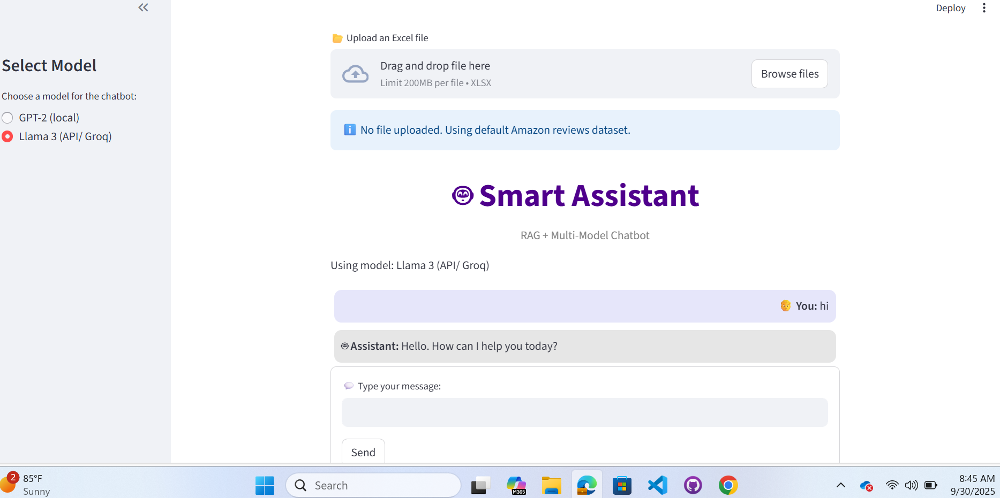

# chatbot-sales

# 📦 Amazon Product Data Analysis & Chatbot

 
  
  


Analyze Amazon product data using Python and Excel, perform sentiment analysis, and explore insights through an AI-powered chatbot — with support for running either GPT-2 or LLaMA 3, so you can choose the model that best fits your needs.

---

## Table of Contents
- [Project Overview](#project-overview)
- [Dataset](#dataset)
- [Data Dictionary](#data-dictionary)
- [Technology Stack](#technology-stack)
- [Installation & Setup](#installation--setup)
- [Analysis & Insights](#analysis--insights)
- [Chatbot Integration](#chatbot-integration)
- [Screenshots](#screenshots)
- [License](#license)
- [Author & Acknowledgments](#author-acknowledgments)

---

## Project Overview
This project focuses on exploring, analyzing, and extracting insights from the **Amazon Product Dataset** using Excel and Python. The project demonstrates how to:  
- Perform data cleaning and preprocessing using **Pandas**  
- Conduct exploratory data analysis (EDA) to answer business questions  
- Apply **AI models from Hugging Face** for sentiment analysis of reviews  
- Build a **basic chatbot** to answer queries about products and insights.

The ultimate goal is to provide actionable insights on product performance and customer sentiment while demonstrating AI-assisted analytics.

---

## Dataset
The dataset contains product and review information from Amazon. It includes **16 columns** with details like pricing, ratings, reviews, and user information.  

**Data Source:** Local Excel file

### Data Dictionary

<details>
<summary>Click to view the full columns you'll find in the Excel file:</summary>

| Column              | Description                                   |
|--------------------|-----------------------------------------------|
| product_id         | Unique identifier for each product           |
| product_name       | Full product name                             |
| category           | Product category (may include multiple levels) |
| discounted_price   | Price after discount                          |
| actual_price       | Original price before discount                |
| discount_percentage| Discount as a percentage                      |
| rating             | Average product rating                        |
| rating_count       | Total number of ratings                       |
| about_product      | Short product description                     |
| user_id            | Unique identifier of reviewer                 |
| user_name          | Name of the reviewer                           |
| review_id          | Unique ID of the review                        |
| review_title       | Title or summary of the review                |
| review_content     | Full text of the review                        |
| img_link           | Link to the product image                      |
| product_link       | Link to the product page                        |

</details>


---

## Technology Stack
- **Programming Language**: Python 3.11  
- **Data Analysis & Visualization**: Pandas, NumPy, Matplotlib, Seaborn  
- **Machine Learning / NLP**: 
  - Hugging Face Transformers (GPT-2, LLaMA)  
  - PyTorch (deep learning backend)  
  - scikit-learn (TF-IDF, similarity measures)  
- **Interface**: 
  - Jupyter Notebook (exploration)  
  - Streamlit for chatbot
- **Version Control**: Git & GitHub  

---

## Installation & Setup
### 1. **Clone the repository**
```bash
git clone https://github.com/RazanAlkhaluqy/chatbot-sales.git
cd chatbot-sales
```
### 2. Create a virtual environment (recommended)
```bash
conda create -n chatbot_env python=3.10 -y
conda activate chatbot_env
```
### 3. Install dependencies

```bash
pip install -r requirements.txt
```
(if you don’t have a requirements.txt, you can create one with pip freeze > requirements.txt)

### 4. Run the app (Streamlit)
To run and see the chatbot in the browser:
```bash
streamlit run src/chatbot.py
```
to view the analysis results and feature engineering and sentiment analysis in Jupyter Notebook:
```bash
jupyter notebook excel_analysis.ipynb
```

## Analysis & Insights

**Exploratory Analysis:**  
Examined product categories, top-rated products, price distributions, and rating trends.

**Business Questions:**  
Answered at least five business questions, such as top-selling categories and highest-rated products.

**Visualizations:**  
- Overall Review Sentiment Distribution 
- Average Sentiment Score per Main Category
- Top 10 Products by Revenue

---

## Chatbot Integration

- A simple AI-powered chatbot  
- Allows users to query insights such as:  
  - Top products by category  
  - Average ratings  
  - Sentiment trends of reviews  

---

## Screenshots



---

## License

This project is licensed under the **MIT License**. See the [LICENSE](LICENSE) file for details.

---

## Author& Acknowledgments

**Author:** Razan Zaki  

**Acknowledgments:**  
- I would like to thanks to my mentors Mr. Osamah Sarraj and director Mr. Mohammed Sharaf, for their guidance and support throughout the project.  

This project was developed as part of an Analyze Amazon product data & chatbot from Excel file.

